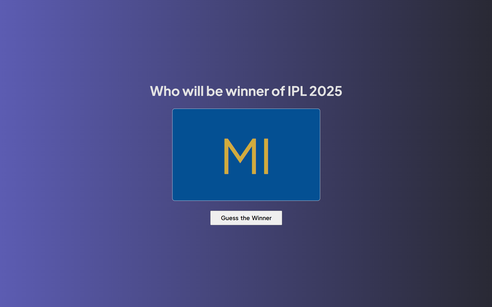

# 🏆 Guess the IPL Winner – 2025 Edition

A fun web-based app that **randomly guesses** the winner of **IPL 2025**! Just click the button and see which team is picked 🏏✨

---

## 📸 Preview

 

---

## 🎮 Live Demo

[Live Demo](https://guess-ipl-winner.vercel.app/) 

---

## 🔧 Tech Stack

- HTML5
- CSS3
- JavaScript (Vanilla)

---

## 🧠 How It Works

- A list of all 10 IPL teams is maintained in an array with their primary and secondary team colors.
- On clicking the "Guess the Winner" button, a random team is selected.
- The selected team's **name** is shown inside the box.
- The **box background** takes the team’s **primary color**.
- The **text color** reflects the team’s **secondary color**.

---

## ✨ Features

- 🎯 Random team picker
- 🎨 Dynamic color changes based on the selected team
- ⚡ Smooth UI with Flexbox layout
- 📱 Responsive design

---

## 🗂️ Project Structure

```
📁 guess-ipl-winner
├── index.html
├── style.css
├── script.js
└── README.md
```

---

## 🚀 Getting Started

1. Clone the repository:
   ```bash
   git clone https://github.com/KushagraSharma10/Guess-IPL-winner.git
   ```
2. Open `index.html` in your browser.
3. Click on **Guess the Winner** and enjoy the fun!

---

## 📚 Purpose of the Project

This mini-project was built for **learning DOM manipulation**, working with **arrays of objects**, and adding **dynamic style changes** using JavaScript. A great exercise to understand real-time interactions on the web!

---

## 👨‍💻 Author

**Kushagra Sharma**  
📍 Alwar, India  
💡 Full Stack Developer | IPL Fan 😄

---

## 🌟 Show Some Love

If you liked this project, feel free to ⭐ the repo [Github](https://github.com/KushagraSharma10/Guess-IPL-winner) and share it with your friends!

